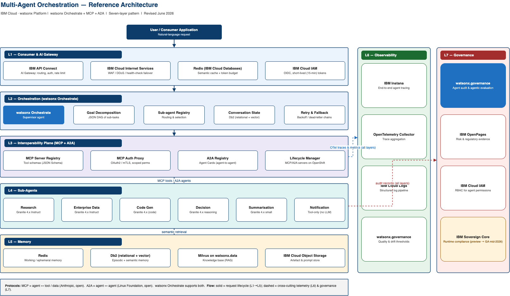

---

copyright:
  years: 2026
lastupdated: "2026-06-16"

keywords: multi-agent systems, watsonx orchestrate, agent orchestration, mcp, a2a, watsonx governance, agentic ai, enterprise ai, reference architecture

subcollection: pattern-multiagent-orchestration-architecture

---

{{site.data.keyword.attribute-definition-list}}

# Multi-Agent Orchestration Reference Architecture
{: #multi-agent-orchestration-reference-architecture}

This reference architecture provides a production-ready blueprint for building enterprise-grade multi-agent systems on IBM Cloud, leveraging watsonx Orchestrate for orchestration, open protocols (MCP and A2A) for interoperability, and watsonx.governance for regulatory-grade audit trails. The pattern addresses the complete lifecycle from API gateway through governance, defining seven architectural layers with clear separation of concerns, IBM Cloud service mappings, and anti-patterns to avoid. It is designed for regulated industries requiring sovereignty controls, hybrid deployment flexibility, and continuous compliance evidence collection.

## Pattern overview
{: #pattern-overview}

This reference architecture defines the design, deployment, and operational patterns for building production-grade multi-agent systems on IBM Cloud using watsonx Orchestrate as the orchestration plane, MCP for tool and data integration, and A2A for agent-to-agent collaboration. It covers supervisor/sub-agent hierarchies, persistent agent memory, MCP/A2A topology, governance wiring, and observability.

## Pattern components
{: #pattern-components}

| Element | Selection |
|---|---|
| Orchestration engine | watsonx Orchestrate |
| Agent-to-tool protocol | Model Context Protocol (MCP) |
| Agent-to-agent protocol | Agent-to-Agent (A2A) — originated by Google, governed by the Linux Foundation |
| Governance layer | watsonx.governance (model + agentic governance) |
| Observability | IBM Instana + OpenTelemetry |
{: caption="Pattern overview components" caption-side="bottom"}

## Executive Summary
{: #executive-summary}

Enterprise AI has crossed the threshold from single-model inference to coordinated networks of autonomous agents. IBM's watsonx Orchestrate — generally available with a large catalogue of enterprise connectors and prebuilt agents — combined with the open Model Context Protocol (MCP) and the open Agent-to-Agent (A2A) protocol, provides a technical foundation for production-grade multi-agent systems. This document defines a seven-layer reference architecture — from user interface through to governance audit trails.

IBM's differentiator in this space is **not** orchestration capability alone, and — importantly — it is no longer that agent auditing exists *only* on IBM. All three major hyperscalers now provide agent observability and tracing. IBM's defensible advantage is the **depth and regulatory grade of its governance**: watsonx.governance factsheets, agentic evaluation metrics, the Governance Graph, and the Risk Atlas, wired into IBM OpenPages for regulator-ready evidence, plus a sovereignty story (IBM Sovereign Core) and a genuinely hybrid/on-prem deployment model (Red Hat OpenShift). This pattern makes those differentiators architecturally concrete.

- Architecture Decision: This pattern uses watsonx Orchestrate as the multi-agent control plane over custom-built orchestration because it is production-ready, provides an extensive enterprise connector catalogue, watsonx Orchestrate supports MCP for tool integration and provides a built‑in collaborator‑agent framework that can be extended to interoperate with external agents via custom adapters and integrates natively with watsonx.governance for agent audit and evaluation. Custom frameworks (LangGraph, AutoGen, CrewAI) remain valid for specific sub-agent implementations and can be registered as A2A collaborators or exposed via MCP — not as replacement orchestrators.

## Context and Problem Statement
{: #context-and-problem-statement}

### Why Multi-Agent Architecture
{: #why-multi-agent-architecture}

Single-model inference patterns — including RAG — are insufficient for enterprise workflows that require parallel execution of heterogeneous tasks, specialised domain expertise across multiple models, tool use with external systems, iterative reasoning with feedback loops, and long-running stateful workflows with human-in-the-loop checkpoints.

Multi-agent systems address this by decomposing complex goals into sub-tasks, routing each to a specialised agent, coordinating the results, and maintaining shared context — all governed by an orchestration plane that handles failure, retry, and escalation.

## Architecture Overview
{: #architecture-overview}

### Seven-Layer Model
{: #seven-layer-model}

The below diagram shows the pattern architecture for multi-agent orchestration.

{: caption="Seven-layer multi-agent orchestration architecture" caption-side="bottom"}

The reference architecture is structured into seven horizontal layers. Each layer has defined responsibilities, IBM Cloud service assignments, failure modes, and integration contracts with adjacent layers. The layered model ensures separation of concerns — governance does not bleed into routing; memory does not couple to inference.

| Layer | Components and responsibilities |
|---|---|
| **L1 Consumer** | IBM API Connect (AI Gateway) · IBM Cloud Internet Services (WAF) · OIDC/IAM authentication · Rate limiting & token budgets · Semantic cache (Redis) |
| **L2 Orchestrator** | watsonx Orchestrate (supervisor agent) · Goal decomposition engine · Sub-agent registry · Conversation state manager (Db2) · Retry & fallback controller |
| **L3 Interop Plane (MCP + A2A)** | MCP server registry & tool schemas · MCP auth proxy (OAuth2/mTLS) · **A2A agent registry & Agent Cards** for agent-to-agent collaboration · Server/agent lifecycle manager (OpenShift) · Protocol routing |
| **L4 Sub-Agents** | Domain sub-agents (Granite 4.x / third-party LLMs via the AI Gateway) · Agent tool bindings · Short-term session memory · Agent health monitor (Instana) · Prompt template store |
| **L5 Memory** | Db2 (relational + vector) — long-term agent memory · Milvus on watsonx.data — semantic retrieval · IBM Cloud Object Storage — artefact store · Redis — ephemeral session cache |
| **L6 Observability** | IBM Instana — end-to-end agent tracing · OpenTelemetry collector — trace aggregation · watsonx.governance — quality & drift thresholds · IBM Cloud Logs — structured log pipeline |
| **L7 Governance** | watsonx.governance — agent behaviour audit & evaluation · IBM OpenPages — risk & compliance evidence · IBM IAM — RBAC for agent permissions · IBM Sovereign Core — runtime compliance controls (generally available since Think 2026, May 2026) |
{: caption="Seven-layer architecture model" caption-side="bottom"}

### Data Flow: Request Lifecycle
{: #data-flow-request-lifecycle}

1. User sends a natural-language request. IBM API Connect (L1) authenticates via IBM Cloud IAM, checks token budget against the tenant quota, and queries the Redis semantic cache. On a cache hit, the cached response is returned immediately and the interaction is logged to watsonx.governance.
2. On a cache miss, API Connect forwards the request to watsonx Orchestrate (L2). The supervisor agent classifies intent, decomposes the goal into a directed acyclic graph (DAG) of sub-tasks, and loads conversation history from the Db2 conversation state store.
3. For each sub-task, watsonx Orchestrate consults the sub-agent registry. Internal tools and enterprise systems are called via **MCP**; collaboration with external or third-party agents is performed via **A2A**. The auth proxy validates OAuth2 tokens before forwarding.
4. Each sub-agent (L4) receives its task, loads short-term session memory, executes inference (Granite 4.x, third-party LLM via the AI Gateway, or a tool-only agent), and returns a structured response. Instana traces each hop with token count, latency, and model-version metadata.
5. Responses requiring retrieval trigger a semantic search to Milvus (L5). Retrieved context is ranked, injected into the sub-agent's prompt, and recorded in watsonx.governance with retrieval-source lineage.
6. IBM Instana (L6) assembles the distributed trace across all hops into a single correlated request span. Token cost, per-agent latency, and tool-call counts are attributed to the originating tenant. Threshold violations alert (e.g., via PagerDuty).
7. watsonx.governance (L7) records the complete interaction: agents invoked, tools and external agents called, data accessed (and jurisdiction), model versions, and final output. IBM OpenPages ingests the record for regulatory evidence. IBM Sovereign Core validates that no data left its designated jurisdiction.

## Layer Specifications
{: #layer-specifications}

### Layer 1 — Consumer & AI Gateway
{: #layer-1-consumer-ai-gateway}

**Responsibilities.** L1 is the single entry point for all agent interactions. It enforces authentication, applies rate limiting and token budgeting per tenant, routes to the correct agent pipeline, and returns cached responses where available. No request reaches the orchestration layer without passing through L1.

| Service | Role | Configuration note |
|---|---|---|
| IBM API Connect | Primary AI gateway — routing, auth, rate limiting | Deploy with DataPower Gateway for enterprise policy enforcement. Configure per-tenant plans with token-per-minute quotas. |
| IBM Cloud Internet Services (CIS) | WAF, DDoS protection, health-check failover | Health checks against the watsonx Orchestrate endpoint every 30s; failover to secondary region on 3 consecutive failures. |
| Redis on IBM Cloud Databases | Semantic cache layer | Cache embeddings of recent queries + responses. TTL 1h for factual queries; 5m for time-sensitive/personalised. Use watsonx.ai (Granite) embeddings as the cache key hash. |
| IBM Cloud IAM | Identity & OIDC token validation | Issue short-lived (15-minute) service tokens for agent-to-agent and tool calls. Never use long-lived API keys for inter-agent communication in production. |
{: caption="Layer 1 services and configuration" caption-side="bottom"}

- Anti-pattern: bypassing the gateway: Exposing watsonx Orchestrate endpoints directly to clients removes rate limiting, token budget enforcement, and the semantic cache. Observed in PoC-to-production migrations; creates uncontrolled cost exposure. Every request path must route through L1.

### Layer 2 — Orchestration (watsonx Orchestrate)
{: #layer-2-orchestration}

**Supervisor agent design.** watsonx Orchestrate functions as the supervisor — the top-level reasoner that receives user goals, decomposes them, dispatches sub-agents (via MCP tools and A2A collaborators), collects results, resolves conflicts, and synthesises the final response. The supervisor does not perform domain reasoning directly; it delegates to sub-agents.

**Goal decomposition.** The supervisor uses a structured decomposition prompt that produces a JSON DAG of sub-tasks. Each node specifies the target sub-agent, the input context slice, the expected output schema (JSON Schema), upstream dependencies, and fallback behaviour on failure.

- Design principle: thin supervisor: The supervisor should contain minimal domain logic — decomposition strategy, routing rules, conflict resolution, and escalation conditions only. Domain knowledge lives exclusively in sub-agents. A supervisor with domain logic becomes a bottleneck, a failure point, and a governance liability: it is harder to audit one complex agent than five simple specialised ones.

**Conversation state management.**
- Store conversation history in IBM Cloud Db2 (relational) with a vector column for semantic similarity lookups.
- Schema: `conversation_id, turn_sequence, agent_id, role (user/assistant/tool), content_text, content_embedding (vector), created_at, governance_ref`.
- Load the last *N* = 10 turns (configurable) into the supervisor context window per request.
- Archive conversations older than 90 days to IBM Cloud Object Storage; retain `governance_ref` links permanently for audit continuity.
- Never store PII in `content_text` without field-level encryption via IBM Key Protect.

**Retry and fallback.**

| Failure type | Detection | Retry strategy | Fallback |
|---|---|---|---|
| Sub-agent timeout | Instana span exceeds SLO threshold | 3 retries, exponential backoff (1s, 2s, 4s) | Route to backup sub-agent or degrade gracefully with partial result |
| MCP/A2A call error | HTTP 5xx from server/agent | 2 retries, then dead-letter to IBM Event Streams | Return structured error to supervisor; log to governance |
| Model inference failure | Non-parseable or empty output | Re-prompt with simplified instruction, 1 retry | Switch to deterministic rule-based fallback agent |
| Governance block | watsonx.governance threshold violation | No retry — block is intentional | Return refusal response; log violation to OpenPages |
{: caption="Retry and fallback strategies" caption-side="bottom"}

### Layer 3 — Interoperability Plane (MCP + A2A)
{: #layer-3-interoperability-plane}

**What the protocols provide.** Two complementary open standards operate here:

- **MCP (Model Context Protocol)** — Standardises how agents connect to **tools and data sources**: a tool schema (JSON Schema), a structured request/response protocol, a server registry for discovery, and OAuth2/mTLS authentication at tool boundaries.
- **A2A (Agent-to-Agent)** — originated by Google, donated to the **Linux Foundation** (June 2025), with 150+ supporting organisations by 2026. Standardises **agent-to-agent** communication: capability discovery via *Agent Cards*, a task lifecycle (submitted → working → input-required → completed/failed/canceled), over HTTP + Server-Sent Events + JSON-RPC 2.0.

watsonx Orchestrate supports **both**: MCP for importing tools/servers, and A2A  for integrating external agents as collaborators. (IBM also contributed the earlier Agent Communication Protocol, ACP, in 2025; the ecosystem has since converged on A2A for agent-to-agent interoperability.)

**Server/agent topology.** Three categories of MCP server, plus A2A collaborators, deployed and scaled independently on Red Hat OpenShift:

- **Enterprise system MCP servers** — expose SAP, Salesforce, ServiceNow, Db2, etc. as MCP tool endpoints. Stateless servers that translate MCP tool calls into enterprise API calls; implemented using watsonx Orchestrate's connector framework.
- **Domain knowledge MCP servers** — provide semantic retrieval from watsonx.data (Milvus) for specific domains (product catalogue, policy documents, customer history), each with scoped access controls to prevent cross-domain leakage at the architectural level.
- **Capability MCP servers** — expose general capabilities (code execution, document processing, image analysis, calculation) as reusable tools. Deploy on IBM Cloud Code Engine for serverless scaling.
- **A2A collaborators** — external/third-party agents (built on BeeAI, LangGraph, CrewAI, or other platforms) registered as A2A collaborators with published Agent Cards.

**Authentication model.** Every MCP/A2A call must be authenticated. The auth proxy (OpenShift sidecar) enforces:
- OAuth2 client-credentials flow for machine-to-machine calls; IBM Cloud IAM issues short-lived (15-minute) tokens.
- mTLS for intra-cluster communication; certificates managed by IBM Certificate Manager.
- Scoped permissions — each sub-agent's service identity is granted only the tool scopes / agent collaborations it requires. No wildcard permissions.
- All calls logged with caller identity, target server/agent, tool/skill name, input hash (not raw input — PII protection), output hash, latency, and governance correlation ID.

### Layer 4 — Sub-Agents
{: #layer-4-sub-agents}

**Design principles.**
- Each sub-agent is responsible for exactly one domain or capability. It must not call another sub-agent directly — inter-agent routing goes through the supervisor (L2), using MCP for tools and A2A for agent collaboration.
- Sub-agents are stateless between turns. Session memory lives in the L5 memory layer and is injected via the call context.
- Each sub-agent has a documented system prompt, input schema, output schema, and a set of permitted tool/agent bindings — version-controlled in IBM Cloud Object Storage.
- Sub-agents declare their model dependency. If the assigned model is unavailable, the sub-agent falls back to a defined backup model within the same capability tier (the Orchestrate AI Gateway can route across Granite, Claude, OpenAI, Gemini, Mistral, and others).

**Recommended sub-agent catalogue (illustrative).**

| Sub-agent | Recommended model | Key tools | Notes |
|---|---|---|---|
| Research agent | Granite 4.x H-Tiny Instruct (7B) | watsonx.data (Milvus), web search, document reader | Stream output for long-form research |
| Enterprise data agent | Granite 4.x H-Tiny Instruct (7B) | Db2 query, SAP connector, Salesforce connector | Read-only tool bindings by default |
| Code generation agent | Granite 4.x (code-capable) | Code execution (Code Engine), GitHub connector | Sandboxed execution mandatory |
| Decision agent | Granite 4.x reasoning ("thinking") | OpenPages (risk rules), regulatory tools | Compliance-sensitive; all outputs to governance |
| Summarisation agent | Granite 4.x small (edge-class) | Document reader, IBM Fusion CAS | High-volume, low-latency; candidate for LinuxONE inference |
| Notification agent | Tool-only (no LLM) | Email, Slack, ServiceNow connectors | Deterministic; pure tool/skill dispatch |
{: caption="Recommended sub-agent catalogue" caption-side="bottom"}

### Layer 5 — Memory Architecture
{: #layer-5-memory-architecture}

This pattern defines four memory types, each with a distinct backend, scope, lifetime, and access pattern.

| Memory type | Scope | Lifetime | Backend | Use case |
|---|---|---|---|---|
| Working memory | Single turn | Request duration | Redis (in-memory) | Current sub-task context, intermediate results |
| Episodic memory | Per conversation | Session TTL (4h default) | Redis + Db2 (relational) | Conversation history, in-session preferences |
| Semantic memory | Per user / tenant | Persistent | Db2 (vector column) | Long-term preferences, past interaction patterns |
| Knowledge base | Per domain | Managed update cycle | Milvus (watsonx.data) | Domain knowledge, policy/product data for RAG |
{: caption="Memory architecture types" caption-side="bottom"}

> **Memory security requirement.** All stores holding user data must be encrypted at rest using IBM Key Protect with customer-managed root keys (BYOK). Access to the Db2 semantic store must be gated by IBM Cloud IAM with row-level security — sub-agents must not read other tenants' memory. Memory writes must produce an immutable governance record in watsonx.governance.

### Layer 6 — Observability
{: #layer-6-observability}

**IBM Instana as the AI tracing backbone.** In a multi-agent architecture, a single user request generates a trace tree spanning the API Connect hop, supervisor reasoning spans, each MCP tool call and A2A collaboration with attribution, each LLM inference (token count + latency), each memory read/write, and final synthesis. Instana correlates these under a single trace ID derived from the governance correlation ID generated at L1.

**Key metrics.**

| Metric | Target SLO | Alert threshold | Owner layer |
|---|---|---|---|
| End-to-end request latency (P99) | < 8 s | > 12 s | L1 — API Connect |
| Supervisor decomposition time | < 800 ms | > 2 s | L2 — Orchestrate |
| Sub-agent inference latency (P95) | < 3 s | > 6 s | L4 — Sub-agents |
| MCP/A2A call success rate | > 99.5% | < 99.0% | L3 — Interop plane |
| Semantic cache hit rate | > 30% | < 15% sustained | L1 — Redis |
| Token cost per request (by tenant) | < defined budget | > 120% of budget | L1 — API Connect |
| Governance audit record creation rate | 100% of requests | < 99.9% | L7 — Governance |
{: caption="Key observability metrics and SLOs" caption-side="bottom"}

### Layer 7 — Governance
{: #layer-7-governance}

**Agent behaviour auditing and evaluation.** watsonx.governance agentic capabilities (introduced 2025, expanded through 2026) trace agent decision chains, not just model outputs. Every invocation produces a governance record: originating request context; which sub-agents were invoked and in what sequence; which tools/agents were called and with what parameters; which data sources (and jurisdictions) were accessed; the final output with confidence metadata; and whether any governance policy was triggered. Agentic evaluation metrics include context relevance, faithfulness, answer similarity, and tool-selection quality.

**Five governance checkpoints.**

| # | Checkpoint | What is checked | Enforcing service |
|---|---|---|---|
| 1 | Pre-deployment model registration | Every model used by any sub-agent is registered in watsonx.governance with a factsheet, fairness metrics, and declared use-case scope before it can be bound to an agent. | watsonx.governance model registry |
| 2 | Pre-execution policy check | Before dispatch, the policy engine checks whether the requested tool/agent combination is permitted for the tenant and jurisdiction. | watsonx.governance policy engine + IBM Sovereign Core |
| 3 | Real-time output monitoring | Sub-agent outputs are sampled (10% default, 100% for high-risk task types) and checked for hallucination indicators, PII leakage, and toxicity. | watsonx.governance + IBM OpenPages |
| 4 | Post-interaction drift detection | watsonx.governance compares the sub-agent's output distribution against its baseline; drift beyond threshold triggers alert and optional shadow-testing. | watsonx.governance drift monitor + IBM Instana |
| 5 | Regulatory evidence collection | The complete record for regulated interaction types is exported to IBM OpenPages in a structured format aligned with GDPR Article 22, EU AI Act, and FDA 21 CFR Part 11 audit requirements. | IBM OpenPages + watsonx.governance |
{: caption="Five governance checkpoints" caption-side="bottom"}

## Architecture Decision Records
{: #architecture-decision-records}

Each decision was made after evaluating competing approaches against the IBM Cloud service landscape, target use cases, and governance requirements. Deviations are permitted but must be documented with equivalent rationale.

| Decision | Alternatives considered | Chosen | Rationale |
|---|---|---|---|
| **Orchestration engine** | LangGraph, AutoGen, CrewAI, custom-built on OpenShift | **watsonx Orchestrate** | GA product with an extensive connector catalogue, native watsonx.governance integration, IBM support SLAs, open MCP + A2A support, and an agentic control plane. LangGraph/CrewAI remain valid for sub-agent internals, registered as A2A collaborators — not as the supervisor. |
| **Agent-to-tool protocol** | REST/HTTP, gRPC, LangChain tool format | **MCP** | Open standard for tool/data access: standardised schema, structured auth, server discovery. Supported natively by watsonx Orchestrate. |
| **Agent-to-agent protocol** | Custom message bus, proprietary RPC | **A2A** | Open standard (Google → Linux Foundation) for agent collaboration and discovery via Agent Cards. Lets agents built by different teams/vendors interoperate without custom adapters. Supported by the watsonx Orchestrate ADK (1.15.0+), which implements A2A protocol version 0.3 for agent registration and operation. |
| **Supervisor model** | Third-party GPT-class, Llama 4, Granite 4.x Instruct | **Granite 4.x reasoning ("thinking") variant** | Multi-step decomposition needs reasoning. Granite reasoning variants provide this without the cost/sovereignty concerns of third-party models. Falls back to Granite 4.x H-Small Instruct (32B/9B active). |
| **Conversation state store** | Redis only, PostgreSQL, Cloudant | **Db2 (relational + vector)** | Row-level security for tenant isolation, vector column for semantic retrieval, governance-tooling integration. Redis retained as ephemeral working memory only. |
| **Vector store** | Elasticsearch, pgvector, Pinecone | **Milvus via watsonx.data** | IBM-managed within watsonx.data: data-lineage tracking, access governance, Iceberg table support. No external SaaS dependency. |
| **MCP/A2A server runtime** | AWS Lambda, Cloud Functions, bare VMs | **Red Hat OpenShift (IBM Cloud)** | Portability to hybrid environments, native mTLS via OpenShift Service Mesh, consistent deployment model with the watsonx platform. |
| **Observability backend** | Datadog, Prometheus + Grafana, CloudWatch | **IBM Instana + OpenTelemetry** | IBM-owned, integrates with watsonx inference endpoints, and emits AI-semantic trace attributes (token counts, model version, agent ID). OpenTelemetry keeps it vendor-portable. |
| **Governance audit store** | Elasticsearch, custom DB, S3-compatible | **watsonx.governance + IBM OpenPages** | Provides regulatory-grade evidence collection (GDPR, EU AI Act, FDA) alongside agentic evaluation. Competitors now provide agent observability, but IBM's regulatory-evidence depth via OpenPages remains differentiated. |
{: caption="Architecture decision records" caption-side="bottom"}

## Deployment Guide
{: #deployment-guide}

### Terraform Module Structure
{: #terraform-module-structure}

| Module | Layers | Resources provisioned |
|---|---|---|
| `ibm-ai-gateway` | L1 | API Connect instance, CIS load balancer, Redis on IBM Cloud Databases, IAM service IDs and keys |
| `ibm-orchestrate-core` | L2 | watsonx Orchestrate instance, Db2 for state, supervisor configuration, fallback chain definitions |
| `ibm-interop-plane` | L3 | OpenShift project for MCP servers, service mesh (mTLS), OAuth2 proxy, MCP server registry, A2A collaborator registry |
| `ibm-sub-agents` | L4 | Sub-agent deployments on OpenShift, Granite 4.x model bindings on watsonx.ai, system prompt store in COS |
| `ibm-agent-memory` | L5 | Db2 schema (conversations, semantic memory), Milvus collection in watsonx.data, Redis configuration |
| `ibm-agent-observability` | L6 | Instana configuration, OpenTelemetry collector, alert policies, dashboards |
| `ibm-agent-governance` | L7 | watsonx.governance registrations, policy rules, OpenPages integration, Sovereign Core policies |
{: caption="Terraform module structure" caption-side="bottom"}

### Provisioning order
{: #provisioning-order}

1. `ibm-agent-governance` — IAM policies and governance foundation first
2. `ibm-ai-gateway` — networking and authentication infrastructure
3. `ibm-agent-memory` — data stores before services that write to them
4. `ibm-interop-plane` — MCP/A2A infrastructure before sub-agents register
5. `ibm-sub-agents` — after interop plane and memory are available
6. `ibm-orchestrate-core` — supervisor after sub-agents are registered
7. `ibm-agent-observability` — instrumentation last; services must exist to be instrumented

### Environment Configuration
{: #environment-configuration}

| Parameter | Development | Staging | Production |
|---|---|---|---|
| IBM API Connect plan | Lite | Standard | Enterprise |
| Availability zones | 1 | 2 | 3 (MZR) |
| Db2 plan | Developer | Standard | Enterprise with HA |
| Redis plan | Standard | Standard | Standard HA |
| Instana tier | Trial | SaaS Professional | SaaS Enterprise |
| Governance enforcement | Advisory (log only) | Enforcing (block + log) | Enforcing (block + log + OpenPages) |
| Sovereign Core enabled | No | No | Yes (regulated deployments) |
{: caption="Environment configuration by stage" caption-side="bottom"}

## Anti-Pattern Library
{: #anti-pattern-library}

| Anti-pattern | Consequence | Mitigation |
|---|---|---|
| Agent-to-agent direct calls (bypassing supervisor) | Undocumented communication paths that escape governance logging; impossible failure tracing; circular-dependency deadlocks. | All inter-agent communication routes through the supervisor; A2A collaborators are registered and scoped so sub-agents cannot call each other off-path. |
| Monolithic supervisor with domain logic | Single point of failure and a governance audit nightmare; domain changes force re-testing the whole orchestration path. | Enforce the thin-supervisor principle: routing logic only in the supervisor prompt; domain knowledge in versioned sub-agent prompts. |
| Stateless agent with no memory architecture | Each turn treated as new; no context, no preference recall; degraded UX. | Implement all four memory types (working, episodic, semantic, knowledge base) per Layer 5. Don't use context-window length as a substitute for memory architecture. |
| Governance as an afterthought | Adding governance post-deployment leaves audit-trail gaps; regulatory exams require continuous evidence. | Provision `ibm-agent-governance` first. No sub-agent deploys without its model registered. Governance is an infrastructure requirement, not a feature. |
| Shared MCP server across domains | Cross-domain data-leakage risk; access scope impossible to audit cleanly. | One MCP server per knowledge domain, each with its own service identity, IAM scope, and governance policy. Isolation at the server boundary. |
| Cost blindness — no token budgeting | An unconstrained system with 6 sub-agents at 3 retries each can consume ~18× the expected token budget per interaction. | Token budgets at L1 (API Connect); per-agent token tracking in Instana; alert at >120% of budget; semantic caching to cut redundant inference. |
{: caption="Anti-pattern library" caption-side="bottom"}

## Summary and Key Takeaways
{: #summary-and-key-takeaways}

This reference architecture defines a production-grade, seven-layer multi-agent orchestration pattern for IBM Cloud, comparable in depth to AWS Bedrock AgentCore and Azure AI Foundry Agent Service patterns, and differentiated on the dimensions that matter most to regulated-industry customers.

- **Lead with governance depth and sovereignty, not feature exclusivity.** Agent orchestration, observability, evaluation, and open-protocol (MCP + A2A) support are now table stakes across IBM, AWS, Azure, and Google. IBM's defensible edge is regulatory-grade evidence (watsonx.governance + OpenPages), runtime sovereignty (Sovereign Core), and the deepest hybrid/on-prem story (OpenShift).
- **Governance is the architecture, not a feature.** Every layer produces governance records — the structural reason a regulated-industry CIO can approve this for production where a thinner pattern would need custom additions.
- **MCP and A2A are complementary open standards.** MCP connects agents to tools and data; A2A connects agents to each other. This pattern uses both, and watsonx Orchestrate supports both — avoiding the lock-in of proprietary inter-agent protocols.
- **The anti-pattern library is as important as the pattern.** The six anti-patterns are the most common production failure modes. Deviating without documented rationale is the most common cause of failure.
- **Deploy governance first, agents second.** The roadmap provisions watsonx.governance before any sub-agent, creating an unbroken audit trail from day one. Retrofitting governance after go-live creates evidence gaps that cannot be filled retroactively.

## References
{: #references}

The following sources support the product capabilities, protocol specifications, and competitive positioning described in this reference architecture. Links were verified current as of June 2026; vendor pages evolve, so consult the canonical documentation for the latest details.

### IBM watsonx Orchestrate

- [IBM watsonx Orchestrate — Multi-agent orchestration](https://www.ibm.com/products/watsonx-orchestrate/multi-agent-orchestration) — Supervisor/router/planner model, agent styles (ReAct, Plan-Act, deterministic), and AI Gateway model selection.
- [IBM watsonx Orchestrate — AI Agent Builder](https://www.ibm.com/products/watsonx-orchestrate/ai-agent-builder) — No-code/low-code/pro-code build paths and AI Gateway provider choice (Granite, OpenAI, Anthropic, Google Gemini, Mistral, Ollama).
- [watsonx Orchestrate Agent Development Kit (ADK) — Developer documentation](https://developer.watson-orchestrate.ibm.com/) — ADK reference, Developer Edition, and protocol support.
- [watsonx Orchestrate ADK 1.15.0 release notes](https://developer.watson-orchestrate.ibm.com/_releases/1.15.0/release/release) — Confirms ADK support for **A2A protocol version 0.3** (versions 0.2/0.2.1 deprecated).
- [watsonx Orchestrate ADK — Managing LLMs via AI Gateway](https://developer.watson-orchestrate.ibm.com/llm/managing_llm) — Supported AI Gateway providers and routing/fallback configuration.
- [IBM watsonx Orchestrate ADK — GitHub repository](https://github.com/IBM/ibm-watsonx-orchestrate-adk) — Source, CLI, and Python library.

### Open protocols (MCP & A2A)

- [Introducing the Model Context Protocol — Anthropic](https://www.anthropic.com/news/model-context-protocol) — Original MCP announcement (November 2024).
- [Model Context Protocol — Specification](https://modelcontextprotocol.io/specification/2025-11-25) — Authoritative MCP protocol requirements and JSON-RPC schema.
- [Linux Foundation launches the Agent2Agent (A2A) Protocol Project](https://www.linuxfoundation.org/press/linux-foundation-launches-the-agent2agent-protocol-project-to-enable-secure-intelligent-communication-between-ai-agents) — Vendor-neutral governance established 23 June 2025.
- [Google Cloud donates A2A to the Linux Foundation — Google Developers Blog](https://developers.googleblog.com/en/google-cloud-donates-a2a-to-linux-foundation/) — Founding members and project scope.
- [A2A Protocol — Official site](https://a2a-protocol.org/) and [A2A specification (GitHub)](https://github.com/a2aproject/A2A) — Agent Cards, task lifecycle states, and transport (HTTP + SSE + JSON-RPC 2.0).

### IBM Granite models

- [IBM Granite 4.0 — Model documentation](https://www.ibm.com/granite/docs/models/granite) — Hybrid Mamba-2/transformer architecture, MoE, and model tiers (H-Small, H-Tiny, H-Micro, Nano).
- [Introducing the IBM Granite 4.1 family of models — IBM Research](https://research.ibm.com/blog/granite-4-1-ai-foundation-models) — Latest Granite family, instruction-following and tool-calling performance, and toggleable reasoning.

### Governance, sovereignty & observability

- [IBM Sovereign Core reaches general availability — IBM Newsroom (Think 2026)](https://newsroom.ibm.com/2026-05-05-think-2026-ibm-makes-digital-sovereignty-operational-with-general-availability-of-ibm-sovereign-core) — GA announcement (5 May 2026); four sovereignty pillars and runtime enforcement.
- [IBM watsonx.governance](https://www.ibm.com/products/watsonx-governance) — Factsheets, agentic evaluation metrics, Governance Graph, and Risk Atlas.
- [IBM OpenPages](https://www.ibm.com/products/openpages) — Risk and regulatory-compliance evidence management.
- [IBM Instana Observability](https://www.ibm.com/products/instana) — End-to-end distributed tracing for agent workloads.
- [OpenTelemetry](https://opentelemetry.io/) — Vendor-neutral trace/metric/log instrumentation standard.

### IBM Cloud platform services

- [IBM API Connect](https://www.ibm.com/products/api-connect) — API gateway, rate limiting, and policy enforcement (L1).
- [IBM watsonx.data](https://www.ibm.com/products/watsonx-data) — Lakehouse with integrated Milvus vector store (L5 knowledge base).
- [Red Hat OpenShift on IBM Cloud](https://www.ibm.com/products/openshift) — Hybrid runtime for MCP/A2A servers and sub-agents (L3/L4).
