---

copyright:
  years: 2026
lastupdated: "2026-08-20"

keywords: multi-agent systems, watsonx orchestrate, agent orchestration, mcp, a2a, watsonx governance, agentic ai, enterprise ai, reference architecture

subcollection: pattern-multiagent-orchestration-architecture

---

{{site.data.keyword.attribute-definition-list}}

# Multi-Agent Orchestration Reference Architecture
{: #white-paper}

A short description of what your white paper is about and what the reader will learn.
{: shortdesc}

This reference architecture provides a production-ready blueprint for building enterprise-grade multi-agent systems on IBM Cloud, leveraging watsonx Orchestrate for orchestration, open protocols (MCP and A2A) for interoperability, and watsonx.governance for regulatory-grade audit trails. The pattern addresses the complete lifecycle from API gateway through governance, defining seven architectural layers with clear separation of concerns, IBM Cloud service mappings, and anti-patterns to avoid. It is designed for regulated industries requiring sovereignty controls, hybrid deployment flexibility, and continuous compliance evidence collection.

## Pattern overview
{: #pattern-overview}

This reference architecture defines the design, deployment, and operational patterns for building production-grade multi-agent systems on IBM Cloud using watsonx Orchestrate as the orchestration plane, MCP for tool and data integration, and A2A for agent-to-agent collaboration. It covers supervisor/sub-agent hierarchies, persistent agent memory, MCP/A2A topology, governance wiring, and observability.

## Pattern components
{: #pattern-components}

| Element | Selection |
|---|---|
| Orchestration engine | watsonx Orchestrate |
| Agent-to-tool protocol | Model Context Protocol (MCP) |
| Agent-to-agent protocol | Agent-to-Agent (A2A) — originated by Google, governed by the Linux Foundation |
| Governance layer | watsonx.governance (model + agentic governance) |
| Observability | IBM Instana + OpenTelemetry |
{: caption="Pattern overview components" caption-side="bottom"}

## Executive Summary
{: #executive-summary}

Enterprise AI has crossed the threshold from single-model inference to coordinated networks of autonomous agents. IBM's watsonx Orchestrate — generally available with a large catalogue of enterprise connectors and prebuilt agents — combined with the open Model Context Protocol (MCP) and the open Agent-to-Agent (A2A) protocol, provides a technical foundation for production-grade multi-agent systems. This document defines a seven-layer reference architecture — from user interface through to governance audit trails.

IBM's differentiator in this space is **not** orchestration capability alone, and — importantly — it is no longer that agent auditing exists *only* on IBM. All three major hyperscalers now provide agent observability and tracing. IBM's defensible advantage is the **depth and regulatory grade of its governance**: watsonx.governance factsheets, agentic evaluation metrics, the Governance Graph, and the Risk Atlas, wired into IBM OpenPages for regulator-ready evidence, plus a sovereignty story (IBM Sovereign Core) and a genuinely hybrid/on-prem deployment model (Red Hat OpenShift). This pattern makes those differentiators architecturally concrete.

- Architecture Decision: This pattern uses watsonx Orchestrate as the multi-agent control plane over custom-built orchestration because it is production-ready, provides an extensive enterprise connector catalogue, watsonx Orchestrate supports MCP for tool integration and provides a built‑in collaborator‑agent framework that can be extended to interoperate with external agents via custom adapters and integrates natively with watsonx.governance for agent audit and evaluation. Custom frameworks (LangGraph, AutoGen, CrewAI) remain valid for specific sub-agent implementations and can be registered as A2A collaborators or exposed via MCP — not as replacement orchestrators.

## AGENTIC AI DESIGN PATTERNS
{: #agentic-ai-design-patterns}

Agentic AI design patterns are identified as a Single Agent or Multi-Agent approach to accomplish a goal. Multi-agent architectures trade the simplicity of a single reasoning loop for specialization, parallelism, and fault isolation — at the cost of coordination overhead, additional token spend, and compounding error probability across agent-to-agent hops. The pattern selected should be the least complex one that still meets the task's accuracy, latency, and auditability requirements.

---

## What is a single agent design pattern
{: #single-agent-design}

Purpose of a single agent is to perform an autonomous task within a given context and boundary. The agent operates within a defined scope: it receives a goal, breaks it into steps, and executes them independently without requiring human input at each step. Its behavior is governed by a system prompt that sets the role, constraints, and boundaries of what the agent is allowed to do. Within a session, the agent maintains memory of prior steps, allowing it to chain actions and make contextual decisions until the goal is complete.

Mainly used for querying and performing multiple steps to accomplish the task.

**Single agent design pattern uses:**

- **Prompts:** the system prompt defines the agent's role, tone, task boundaries, and constraints. It is the primary mechanism for controlling agent behavior.

- **Knowledge base:** an external data source (vector database, document store, or structured data) the agent queries to retrieve relevant context it was not trained on.

- **Behaviour:** the internal reasoning loop that determines how the agent interprets inputs, decides what action to take next, and when to stop.

- **Tools:** external capabilities the agent can invoke at runtime, such as APIs, web search, code execution, or database queries. Tool connectivity is standardized through the Model Context Protocol (MCP), an open protocol that defines how agents discover, connect to, and call external tools and data sources in a consistent way across frameworks.

### System Design
{: #single-agent-system-design}

A system design that takes you through all the aspects of a single-agent solution.

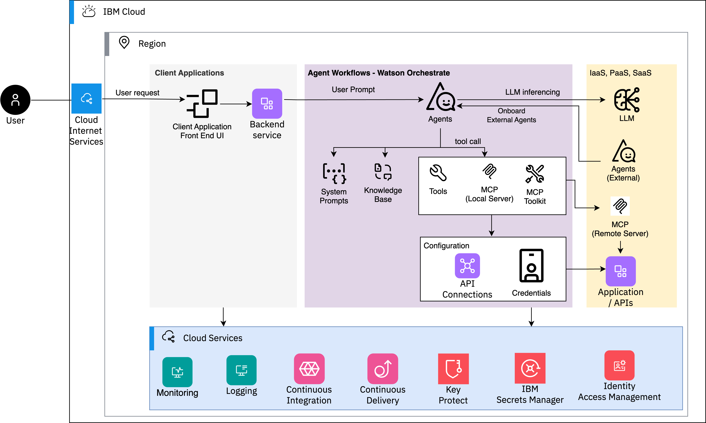
{: caption="Figure 1. Single Agent Design Pattern" caption-side="bottom"}

High level system context with tools and services. A single-agent architecture is composed of four core layers:

- **Orchestration Layer:** receives the user goal, manages the agent loop, and coordinates between components.

- **Tool Registry:** a catalog of available tools the agent can invoke, along with their schemas and access controls. In MCP-based architectures, tools are exposed as MCP Servers — lightweight services that advertise their capabilities to the agent and handle execution. The agent connects to these servers via the MCP client built into the orchestration layer.

- **Memory Store:** maintains short-term (in-session) context and optionally long-term memory across sessions using a vector or key-value store.

- **Output Handler:** validates, formats, and delivers the agent's final response to the consuming application or user.

Single Agents are determined by 3 main categories depending on task complexity, flexibility, transparency, and requirements.

- **Default:** Ideal for quick tasks, very dynamic and prompt driven. The agent responds directly based on its system prompt and input context without an explicit reasoning chain. Best suited for well-defined, low-ambiguity tasks such as summarization, classification, or single-step data retrieval.

- **ReAct:** Ideal for exploratory tasks like research, very adaptive and highly transparent. The agent alternates between Reasoning and Acting: it thinks through the problem, takes an action (e.g., a search or tool call), observes the result, then reasons again. This loop continues until a satisfactory answer is reached, making it highly effective for tasks that require gathering and synthesizing information from multiple sources.

- **Plan-Act:** Ideal for multi-step workflows, very structured and highly transparent. The agent first generates a full plan of steps before executing any action. This separation of planning and execution makes it predictable and auditable, and well-suited for complex workflows where order of operations and error recovery matter.

### Frameworks
{: #single-agent-frameworks}

- Watsonx Orchestrate – low code / no code
- Langchain
- Crew AI
- CUDA
- **Model Context Protocol (MCP):** open standard for agent-to-tool connectivity, enabling agents to communicate with any MCP-compliant server regardless of the underlying framework.

## What is a Multi-agent design pattern
{: #multi-agent-design-pattern}

In multi-agent patterns, specialized agents are combined to solve complex problems through either deterministic workflows between agents or dynamic, coordinated, and orchestrated workflows. Unlike a single agent, multi-agent systems distribute work across agents with distinct roles, tools, and knowledge boundaries — enabling parallelism, specialization, and fault isolation, at the cost of coordination overhead and compounding error probability.

The key design decision is whether agents follow a fixed topology (deterministic — preferred for enterprise, auditable workloads) or dynamically negotiate tasks based on context (orchestrated / LLM-driven — higher flexibility, lower predictability).

### Reliability math: why topology choice matters
{: #reliability-math}

Every additional agent-to-agent hop introduces an independent probability of failure (misrouted task, dropped context, hallucinated intermediate output). For n sequential or hierarchical hops each with independent accuracy p, the compounded end-to-end reliability approximates pⁿ. A 3-step chain at 90% per-step accuracy yields 0.9³ ≈ 73% — not 90%. This is the primary argument for: (a) keeping topologies as shallow as the task allows, (b) placing evaluator/critic checkpoints after high-risk steps rather than only at the end, and (c) reserving open-ended orchestration (such as Magentic, Group Chat) for problems that genuinely cannot be decomposed up front.

### Pattern Comparison Matrix
{: #pattern-comparison-matrix}

| Pattern | Determinism | Latency Profile | Token Cost | Primary Failure Mode |
|---|---|---|---|---|
| Coordinator / Dispatcher | High | Low (1 routing hop) | Low | Misrouting to wrong specialist |
| Hierarchical | High | Medium (multi-tier) | Medium–High | Error compounding across tiers |
| Sequential Pipeline | Very High | Medium (sum of steps) | Medium | Hard stop if one stage fails |
| Concurrent (Fan-Out/Gather) | High | Low (parallel wall-clock) | High (N× calls) | Conflicting outputs at merge |
| Loop (Evaluator-Optimizer) | Medium | High (N iterations) | High (N× calls) | Non-convergence / infinite loop |
| Group Chat / Collaborative Synthesis | Low–Medium | Medium–High | High | Groupthink / unresolved conflict |
| Handoff (Peer-to-Peer) | Medium | Variable | Medium | Dropped context on transfer |
| Magentic (Dynamic Manager) | Low | Unbounded / hard to predict | Very High | Runaway planning loops, cost overrun |
| Custom Logic / Conditional Routing | High | Variable (rule-driven) | Low–Medium | Rule drift / untested branches |
| Human-in-the-Loop Gate | Very High (at gate) | Adds wait time | Low (gate itself) | Approval bottleneck / alert fatigue |
{: caption="Table 1. Multi-agent pattern comparison" caption-side="bottom"}

---

## Multi-Agent deployment pattern description
{: #multi-agent-deployment-patterns}

### 1. Coordinator / Dispatcher Pattern
{: #coordinator-dispatcher-pattern}

A central agent receives the goal, decomposes it into sub-tasks, and delegates each to a specialized agent. It aggregates results and resolves conflicts before returning a final output. This is the multi-agent analogue of an API gateway: one entry point, many backend specialists.

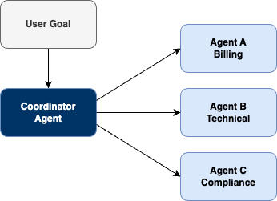
{: caption="Figure 2. Coordinator / Dispatcher Pattern" caption-side="bottom"}

#### Engineering considerations
{: #coordinator-engineering}

- **Latency:** single routing hop — low Time-to-First-Token impact if the coordinator uses a small/fast model.

- **Cost:** cheapest multi-agent topology; only the coordinator's classification call plus one specialist call are billed per request.

- **Failure mode:** misclassification. Mitigate with a confidence threshold on the routing decision and a fallback "clarify with user" branch rather than a forced guess.

---

### 2. Hierarchical Orchestration Pattern
{: #hierarchical-orchestration-pattern}

Agents are organized in layers where higher-level agents plan and lower-level agents execute. Enables complex goal decomposition across multiple tiers of specialization. A central agent routes tasks to domain experts, who may themselves further decompose work to sub-specialists.

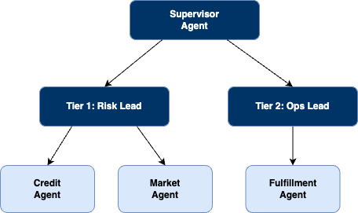
{: caption="Figure 3. Hierarchical Orchestration Pattern" caption-side="bottom"}

#### Engineering considerations
{: #hierarchical-engineering}

- **Best for:** complex, multi-domain problems requiring both strategic oversight and tactical execution.

- **Cost/latency:** moderate token efficiency — some redundancy exists between tiers as context is re-summarized on the way up; latency is the sum of the slowest branch per tier.

- **Compounding error:** apply the pⁿ reliability model per tier, not per agent — a 3-tier hierarchy with 92% per-tier fidelity still degrades to ~78% end-to-end.

- **HITL gate:** place approval checkpoints at Tier 1 (final aggregation) for irreversible actions; Tier 2/3 remain autonomous for read-only analysis.

---

### 3. Sequential Pipeline Pattern
{: #sequential-pipeline-pattern}

Agents operate in a fixed pipeline where the output of one agent becomes the input of the next. Best for tasks with clear, ordered dependencies. This is the most deterministic and lowest-latency-variance multi-agent pattern because a predefined workflow agent — not an LLM — governs the transition between steps.

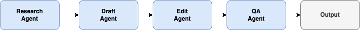
{: caption="Figure 4. Sequential Pipeline Pattern" caption-side="bottom"}

#### Engineering considerations
{: #sequential-engineering}

- **Advantage:** reduced latency and operational cost relative to LLM-orchestrated routing, since no model call is needed to decide "what runs next."

- **Trade-off:** the rigid, predefined structure makes it difficult to adapt to dynamic conditions or skip unnecessary steps — an unneeded slow step still executes, which can inflate cumulative latency.

- **Failure mode:** a hard stop. If the reviewer agent crashes, the editor never runs — pipelines need per-stage retries and dead-letter handling, not silent skips.

---

### 4. Concurrent (Parallel Fan-Out / Gather) Pattern
{: #concurrent-pattern}

Multiple agents work on independent sub-tasks simultaneously and results are merged. Reduces latency for tasks that can be parallelized e.g., a primary agent spawning parallel reviewers to independently check a infrastructure deployment request for security, performance and cost before a gather step consolidates findings.

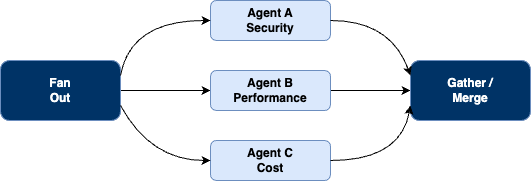
{: caption="Figure 5. Concurrent (Parallel Fan-Out / Gather) Pattern" caption-side="bottom"}

#### Engineering considerations
{: #concurrent-engineering}

- **Advantage:** reduces overall wall-clock latency compared to sequential execution by gathering diverse information from multiple sources at the same time.

- **Trade-off:** running multiple agents in parallel increases immediate resource utilization and token consumption (N× concurrent API calls), raising operational cost and rate-limit pressure; the gather step requires non-trivial logic to reconcile conflicting outputs.

- **Failure mode:** partial results — unlike a sequential pipeline, some branches complete while others fail; design the gather step to degrade gracefully (report partial confidence) rather than block on 100% branch completion.

---

### 5. Loop (Evaluator-Optimizer) Pattern
{: #loop-evaluator-optimizer-pattern}

A producer agent generates output; a critic/evaluator agent scores it against defined criteria; feedback is passed back and the producer revises. The loop repeats until a quality threshold or maximum iteration count is reached.

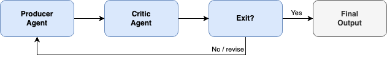
{: caption="Figure 6. Loop (Evaluator-Optimizer) Pattern" caption-side="bottom"}

#### Engineering considerations
{: #loop-engineering}

- **Risk:** non-convergence. Always cap `max_iterations` and define an explicit, machine-checkable exit condition (score ≥ threshold OR iteration count reached) rather than relying on the critic's free-text judgment alone.

- **Cost:** highest per-task token cost of any pattern that terminates in bounded time — each iteration re-sends growing context to both agents.

---

### 6. Group Chat / Collaborative Synthesis Pattern
{: #group-chat-collaborative-pattern}

Multiple agents with different perspectives or roles participate in a shared conversation thread, observed and optionally steered by a moderator (which may be a human, an agent, or both), converging on a consensus response.

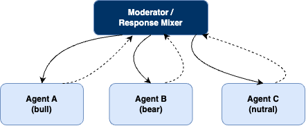
{: caption="Figure 7. Group Chat / Collaborative Synthesis Pattern" caption-side="bottom"}

#### Engineering considerations
{: #group-chat-engineering}

- **Best for:** open-ended analysis, brainstorming, or scenarios requiring multiple expert perspectives where structure emerges dynamically.

- **Trade-off:** lowest determinism of the deterministic-leaning patterns; risk of groupthink or unresolved conflicts if no moderator enforces a termination rule. Token cost is high — every turn is broadcast to all participants.

- **HITL:** group chat is a natural place for a human observer role — read access to the thread without blocking agent turns, escalating only on unresolved disagreement.

---

### 7. Handoff (Peer-to-Peer) Pattern
{: #handoff-peer-to-peer-pattern}

Control passes explicitly from one specialist agent to another as context requirements change, with only one agent active at a time. Handoff orchestration is the canonical implementation, illustrated by a support scenario: triage agent → technical infrastructure agent → financial resolution agent → customer support, with each agent deciding when to redirect.

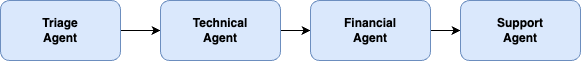
{: caption="Figure 8. Handoff (Peer-to-Peer) Pattern" caption-side="bottom"}

#### Engineering considerations
{: #handoff-engineering}

- **Advantage:** dynamic specialization — one agent can identify the need for a specialist and forward the task, avoiding wasted compute on an ill-suited agent.

- **Risk:** dropped context on transfer. Clear interfaces and an explicit state-transfer payload (not a free-text summary alone) are required so the receiving agent does not have to re-derive prior reasoning.

- **Failure mode:** handoff loops — two agents repeatedly transferring the same task back and forth. Guard with a transfer counter and a forced escalation to a human or default agent after N transfers.

---

### 8. Magentic (Dynamic Manager) Orchestration Pattern
{: #magentic-dynamic-manager-pattern}

A manager agent maintains a live task-and-progress ledger, dynamically assigns and reprioritizes sub-tasks across specialist agents, and loops until the goal is evaluated as complete. Derived from Microsoft Research's MagenticOne system, this is the least deterministic pattern in either vendor's catalog, designed specifically for open-ended problems that do not have a predetermined plan of approach.

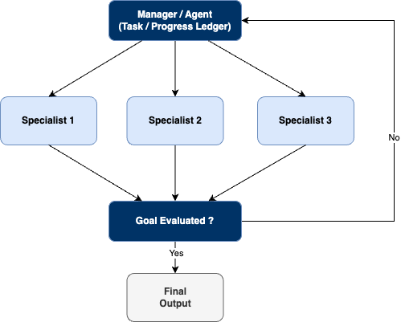
{: caption="Figure 9. Magentic (Dynamic Manager) Orchestration Pattern" caption-side="bottom"}

<:note> ARCHITECTURAL GUIDANCE — use with caution

 Consistent with a preference for structured, predictable workflows: Magentic orchestration should be reserved for problems that genuinely resist upfront decomposition. It is the most powerful pattern and the easiest to misuse — latency is unbounded and hard to predict, token cost is the highest of any pattern (the manager re-plans on every loop), and the primary production risk is a runaway planning loop that silently exhausts budget. If a Sequential or Hierarchical pipeline can be reasoned about and debugged, it is worth more in production than a Magentic workflow with unpredictable token burn.

#### Mandatory guardrails when Magentic is used
{: #magentic-guardrails}

- Hard ceiling on manager re-planning iterations and total tool-call budget per session.
- HITL authorization gate before any tool call that performs a write, delete, or financial action (see Governance section below).
- Real-time cost/latency dashboards with automatic circuit-breaker cutoff on budget or time overrun.

---

### 9. Custom Logic / Conditional Routing Pattern
{: #custom-logic-conditional-routing-pattern}

Workflow routing is driven by conditional rules or business logic rather than a fixed topology or an LLM-driven decision. Allows dynamic branching based on intermediate results while remaining fully deterministic and auditable — the routing function is ordinary code, not a model call.

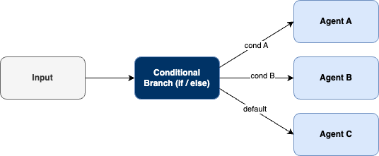
{: caption="Figure 10. Custom Logic / Conditional Routing Pattern" caption-side="bottom"}

#### Cross-reference
{: #custom-logic-cross-reference}

- **Google ADK:** custom Python routing logic layered over `sub_agents`, bypassing AutoFlow's LLM-driven transfer in favor of deterministic if/else branching on structured intermediate output.
- **Azure:** equivalent to workflow-as-code implementations (e.g., Durable Functions / Logic Apps fan-out) driving agent invocation based on business rules rather than model-generated routing.

#### Engineering considerations
{: #custom-logic-engineering}

- Highest auditability of any dynamic-branching pattern — every route is testable with standard unit tests, independent of LLM non-determinism.
- **Risk is rule drift:** as business logic evolves, untested branches accumulate. Treat the routing function itself as production code under the same CI/CD gates as the agents it invokes.

---

### 10. Human-in-the-Loop (HITL) Gate Pattern
{: #human-in-the-loop-pattern}

A human review or approval step is embedded at defined points in the workflow. Critical for high-stakes decisions where full autonomy is not acceptable.

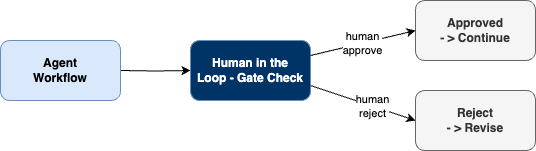
{: caption="Figure 11. Human-in-the-Loop (HITL) Gate Pattern" caption-side="bottom"}

#### Design decisions for every HITL gate
{: #hitl-design-decisions}

- **Mandatory vs. optional:** a mandatory gate makes the orchestration synchronous at that step — persist state at the checkpoint so the workflow can resume without replaying prior agent work.

- **Approval vs. feedback:** decide whether the human response simply advances the workflow (approval) or loops back to the agent for revision (feedback, converging with the Loop pattern above).

- **Scope:** gate specific tool invocations rather than entire agent turns, so the orchestration proceeds autonomously for low-risk actions (read-only queries) and only blocks on sensitive operations (writes, deletes, financial transactions, external communications).

#### Common implementation mistake
{: #hitl-common-mistake}

Creating unnecessary coordination complexity by using a Group Chat or Magentic pattern when a basic Sequential or Concurrent pattern with a single HITL gate would satisfy the requirement. Escalate topology complexity only after confirming the simpler pattern cannot express the required branching.

---

## Multi-Agent Orchestration Implementation
{: #multi-agent-orchestration-implementation}

Multi-Agent Orchestration implementation involves:

- **Local Agent to Agent workflows:** can be implemented using LangGraph, a graph-based orchestration framework where agents are nodes and transitions are edges. Supports stateful, cyclical workflows with fine-grained control over agent sequencing and memory.

- **External / Partner Agents:** communicate using A2A, ACP and MCP standardized protocols that allow agents built on different frameworks or hosted by different organizations to discover, authenticate, and exchange tasks with each other securely.

### Frameworks
{: #multi-agent-frameworks}

- **Local workflows:** Langgraph, Crew AI
- **Agent Communication Protocol (ACP):** Developed by IBM Research. An open protocol for agent-to-agent communication within and across enterprise environments, with support for asynchronous messaging and structured task handoff.
- **A2A Protocol:** Housed by the Linux Foundation and contributed by Google. Designed for cross-organization agent interoperability, enabling agents to collaborate across company and platform boundaries.
- **Model Context Protocol (MCP):** Provides the tool and resource connectivity layer; MCP Servers expose capabilities that any participating agent can discover and invoke, regardless of the orchestration framework in use.
- **Google Agent Development Kit (ADK):** Open-source framework providing native Sequential, Parallel, and Loop workflow agents, plus LLM-driven delegation via AutoFlow — the reference implementation for the patterns detailed above.
- **Microsoft Agent Framework:** Azure's 2025 open-source successor unifying AutoGen's orchestration with Semantic Kernel's enterprise foundations; provides native Sequential, Concurrent, Handoff, Group Chat, and Magentic orchestration across Python and .NET.

---

## Agentic AI Governance
{: #agentic-ai-governance}

### Technical Safeguards
{: #technical-safeguards}

- **Interruptability:** the ability to "turn an agent off." An emergency stop mechanism. User can always activate a graceful shutdown procedure for its agent at any time: both for halting a specific category of actions (revoking access to, e.g., financial credentials) and for terminating the agent's operation more generally. In practice this means every agent must expose a cancellation interface and respect a kill signal within a defined response window.

- **Guardrails:** Agent behavior limits, Role-Based Access Control (RBAC), Prompt filtering, output constraints. Guardrails are enforced at two layers: input guardrails that validate and sanitize what enters the agent, and output guardrails that inspect responses before they are returned. They prevent prompt injection, data leakage, and out-of-scope actions.

- **Testing & Monitoring:** Hallucination detection, compliance checks (feature drift, model drift). Agents must be tested beyond functional correctness; evaluation should include adversarial prompts, boundary condition testing, and red-teaming for misuse scenarios. In production, continuous monitoring tracks behavioral drift over time.

- **Human-in-the-Loop:** Oversight for critical decisions. Defines the threshold at which an agent must pause and escalate to a human before proceeding. The threshold should be risk-calibrated: financial transactions above a limit, irreversible actions, or low-confidence decisions all warrant a human checkpoint.

- **Confidential Data:** Encryption, access control, anonymization. Agents must enforce data minimization by only accessing the data needed for the task. PII and sensitive data should be anonymized before entering the agent context, and all data in transit and at rest must be encrypted.

### Process Controls & Structures
{: #process-controls-structures}

- **Risk-Based Actions:** Define non-autonomous boundaries. Not every action should be fully delegated to an agent. Actions are classified by risk level: read-only operations may be fully autonomous, while write, delete, or financial actions require human approval or a secondary confirmation step.

- **Auditability:** Full traceability of agent decisions. Every decision, tool call, and data access made by an agent must be logged with sufficient detail to reconstruct the reasoning chain. Audit logs should capture: input received, reasoning steps, tools invoked, outputs produced, and the identity of the agent and user.

- **Monitoring:** Real-time observability across layers. Spans the orchestration layer, individual agents, and tool calls. Key signals include latency, token consumption, error rates, tool call frequency, and output confidence scores. Anomaly detection should trigger alerts when behavior deviates from baseline.

- **Accountability:** Clear ownership of models, agents, and orchestration. Each agent in a system must have a designated owner responsible for its behavior, performance, and compliance. Ownership maps to: the model version in use, the system prompt, the tools it can access, and the data it touches.

### Deployment Governance
{: #deployment-governance}

- **Models:** Versioning, performance tracking (hyperparameter optimization). Model versions must be pinned in deployment. Agents should never silently pick up a new model version. Performance baselines are established at release and tracked continuously; regression in accuracy, latency, or safety metrics triggers a rollback.

- **Agent Orchestration:** Guardrails on autonomy. The orchestration layer enforces scope boundaries at runtime. Agents cannot exceed the permissions defined in their deployment configuration. Tool access, data scope, and action types are all constrained by policy, not just by prompt instruction.

- **Security:** Authentication, sandboxing, rate limits. Each agent operates in an isolated execution environment (sandbox) to prevent lateral movement in case of compromise. All tool calls require authenticated service identities. Rate limits prevent runaway agents from exhausting resources or triggering downstream systems unexpectedly.

- **Observability:** Dashboards, alerts, anomaly detection. A unified observability stack covers all agents in the system, not just infrastructure metrics but agent-level behavioral telemetry. Dashboards should surface decision traces, tool call patterns, and confidence distributions alongside standard SRE signals.

Deployment Governance should be part of CI/CD automation during the development of agents. This means governance checks — safety tests, guardrail validation, permission audits, and performance regression tests — are executed as automated gates in the pipeline before any agent reaches production. No agent should be deployable without passing its governance baseline.

## References
{: #references}

The following sources support the product capabilities, protocol specifications, and competitive positioning described in this reference architecture. Links were verified current as of June 2026; vendor pages evolve, so consult the canonical documentation for the latest details.

### IBM watsonx Orchestrate
{: #ibm-watsonx-orchestrate}

- [IBM watsonx Orchestrate — Multi-agent orchestration](https://www.ibm.com/products/watsonx-orchestrate/multi-agent-orchestration) — Supervisor/router/planner model, agent styles (ReAct, Plan-Act, deterministic), and AI Gateway model selection.
- [IBM watsonx Orchestrate — AI Agent Builder](https://www.ibm.com/products/watsonx-orchestrate/ai-agent-builder) — No-code/low-code/pro-code build paths and AI Gateway provider choice (Granite, OpenAI, Anthropic, Google Gemini, Mistral, Ollama).
- [watsonx Orchestrate Agent Development Kit (ADK) — Developer documentation](https://developer.watson-orchestrate.ibm.com/) — ADK reference, Developer Edition, and protocol support.
- [watsonx Orchestrate ADK 1.15.0 release notes](https://developer.watson-orchestrate.ibm.com/_releases/1.15.0/release/release) — Confirms ADK support for **A2A protocol version 0.3** (versions 0.2/0.2.1 deprecated).
- [watsonx Orchestrate ADK — Managing LLMs via AI Gateway](https://developer.watson-orchestrate.ibm.com/llm/managing_llm) — Supported AI Gateway providers and routing/fallback configuration.
- [IBM watsonx Orchestrate ADK — GitHub repository](https://github.com/IBM/ibm-watsonx-orchestrate-adk) — Source, CLI, and Python library.

### Open protocols (MCP & A2A)
{: #open-protocols-mcp-a2a}

- [Introducing the Model Context Protocol — Anthropic](https://www.anthropic.com/news/model-context-protocol) — Original MCP announcement (November 2024).
- [Model Context Protocol — Specification](https://modelcontextprotocol.io/specification/2025-11-25) — Authoritative MCP protocol requirements and JSON-RPC schema.
- [Linux Foundation launches the Agent2Agent (A2A) Protocol Project](https://www.linuxfoundation.org/press/linux-foundation-launches-the-agent2agent-protocol-project-to-enable-secure-intelligent-communication-between-ai-agents) — Vendor-neutral governance established 23 June 2025.
- [Google Cloud donates A2A to the Linux Foundation — Google Developers Blog](https://developers.googleblog.com/en/google-cloud-donates-a2a-to-linux-foundation/) — Founding members and project scope.
- [A2A Protocol — Official site](https://a2a-protocol.org/) and [A2A specification (GitHub)](https://github.com/a2aproject/A2A) — Agent Cards, task lifecycle states, and transport (HTTP + SSE + JSON-RPC 2.0).

### IBM Granite models
{: #ibm-granite-models}

- [IBM Granite 4.0 — Model documentation](https://www.ibm.com/granite/docs/models/granite) — Hybrid Mamba-2/transformer architecture, MoE, and model tiers (H-Small, H-Tiny, H-Micro, Nano).
- [Introducing the IBM Granite 4.1 family of models — IBM Research](https://research.ibm.com/blog/granite-4-1-ai-foundation-models) — Latest Granite family, instruction-following and tool-calling performance, and toggleable reasoning.

### Governance, sovereignty & observability
{: #governance-sovereignty-observability}

- [IBM Sovereign Core reaches general availability — IBM Newsroom (Think 2026)](https://newsroom.ibm.com/2026-05-05-think-2026-ibm-makes-digital-sovereignty-operational-with-general-availability-of-ibm-sovereign-core) — GA announcement (5 May 2026); four sovereignty pillars and runtime enforcement.
- [IBM watsonx.governance](https://www.ibm.com/products/watsonx-governance) — Factsheets, agentic evaluation metrics, Governance Graph, and Risk Atlas.
- [IBM OpenPages](https://www.ibm.com/products/openpages) — Risk and regulatory-compliance evidence management.
- [IBM Instana Observability](https://www.ibm.com/products/instana) — End-to-end distributed tracing for agent workloads.
- [OpenTelemetry](https://opentelemetry.io/) — Vendor-neutral trace/metric/log instrumentation standard.

### IBM Cloud platform services
{: #ibm-cloud-platform-services}

- [IBM API Connect](https://www.ibm.com/products/api-connect) — API gateway, rate limiting, and policy enforcement (L1).
- [IBM watsonx.data](https://www.ibm.com/products/watsonx-data) — Lakehouse with integrated Milvus vector store (L5 knowledge base).
- [Red Hat OpenShift on IBM Cloud](https://www.ibm.com/products/openshift) — Hybrid runtime for MCP/A2A servers and sub-agents (L3/L4).
